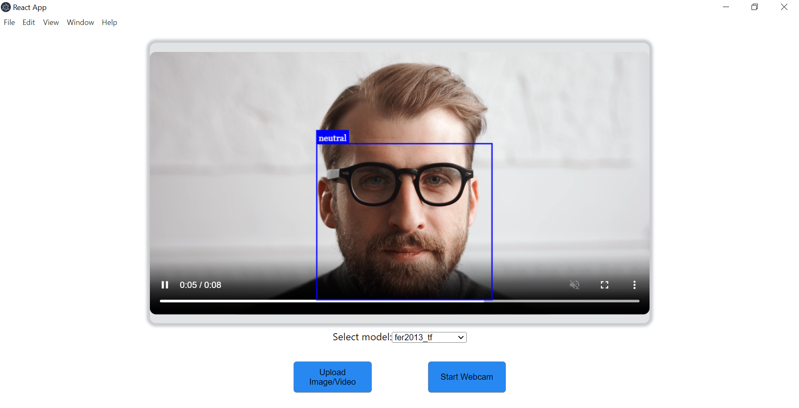

# Emotion Recognition App 😄😢😠

A cross-platform desktop app that uses deep learning to recognize emotions from facial images or video using 8 models (TensorFlow + PyTorch). Developed with React + Electron + FastAPI.

## 📸 Screenshots

### Video Upload Recognition


## 👨‍💻 Tech Stack

- Frontend: ReactJS, Electron, FaceAPI.js
- Backend: Python, FastAPI
- ML: TensorFlow, PyTorch (VGG16 models)

## 💡 Features

- Real-time webcam-based emotion recognition
- Upload image/video for analysis
- Compare 8 emotion models
- Fully local app (no cloud required)

## 🧠 Datasets Used

- FER2013
- KDEF
- NHFI
- Mixed Dataset

## 🧪 Model Training

Each dataset was used to train two models (TensorFlow + PyTorch). A two-phase transfer learning strategy was used with VGG16 as the base model.

## 📊 Model Results

| Dataset  | Framework  | Accuracy | F1 Score |
|----------|------------|----------|----------|
| KDEF     | TensorFlow | 92%      | 0.92     |
| KDEF     | PyTorch    | 91%      | 0.91     |
| NHFI     | TensorFlow | 78%      | 0.76     |
| NHFI     | PyTorch    | 72%      | 0.71     |
| FER2013  | TensorFlow | 67%      | 0.65     |
| FER2013  | PyTorch    | 66%      | 0.63     |
| Mixed    | TensorFlow | 70%      | 0.70     |
| Mixed    | PyTorch    | 68%      | 0.68     |

## 🚀 How to Run It

### Backend
```bash
cd Backend
pip install -r requirements.txt
uvicorn app.main:app --reload
